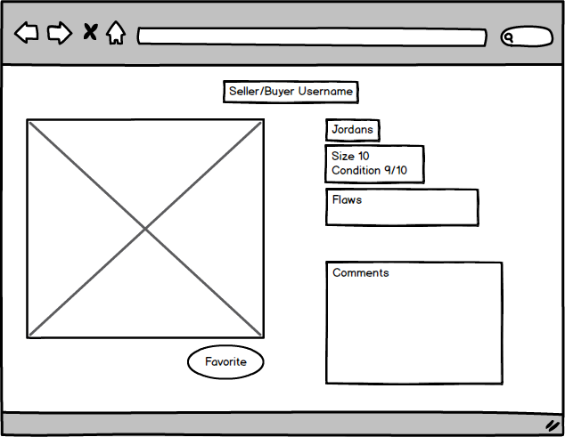
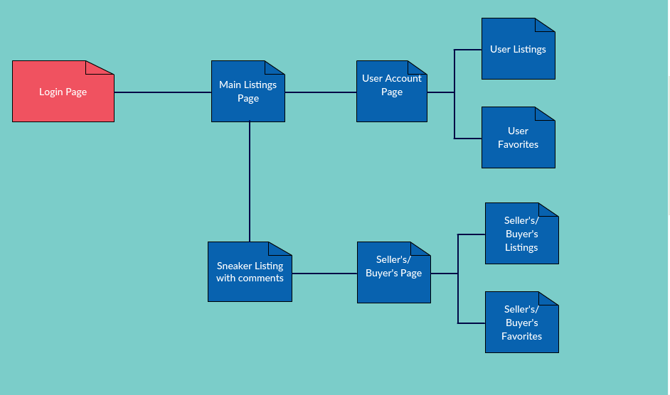

# The Flee Market

## Overview

Sneaker collecting is a hobby that is more prevalent than ever. "Sneakerheads" are emerging left and right, ranging from your 12 year-old cousin in middle school to the hedgefund manager over at Wall St; everyone suddenly has to have the latest Jordans. This surge in demand, of course entails a shortage in supply. Between the mobs of sneaker enthusiasts rioting outside your local Footlocker and the advent of automated online bots that can snatch a dozen pairs simultaneously before your mouse reaches the "Add To Cart" button, buying the latest sneakers has become next to impossible and very much a nightmare. In order to get their sneaker fix, enthusiasts thus turn to the secondary sneaker market. The secondary market comprises of individual peer to peer transactions where buyers can purchase their coveted sneakers at the appropriate market price, from their fellow sneakerheads. 

The Flee Market (TFM) aims to facilitate these secondary market transactions. Catering to both sellers and buyers, TFM would allow users to post a "Buy" or "Sell" listing for a pair of sneakers and allow other users to reply to negotiate a deal, functioning similarly to Craigslist or eBay but with the focus solely on footwear. Buy listings would display the name, size, and picture of the desired shoe and Sell listings would display the name, size, picture(s), condition (rated out of 10), and price of the shoe for sale. Users can also "favorite" listings, operating akin to an "add to cart" feature, to keep a list of the shoes they might potentially purchase. 

## Data Model

This application would store 
* Users 
* Listings (separated into picture(s) and description) 
* Comments.


## Schema

```javascript
// Users
const User = new mongoose.Schema({
  // username, password done through Passport.js
  listings:  [{ type: mongoose.Schema.Types.ObjectId, ref: 'Clip' }]
});

/*
Name
Image of shoe
Shoe size
Condition (out of 10)
Flaws of the shoe
*/

const Item = new mongoose.Schema({
  name: String,
  image: String,
  size: Number,
  condition: Number,
  flaws: String,
  user: {type: mongoose.Schema.Types.ObjectId, ref:'User'},
  comments: [Comment]
});

// a Comment
var Comment = new mongoose.Schema({
  user: {type: mongoose.Schema.Types.ObjectId, ref:'User'},
  text: String
});
```

## Wireframes





## Site map



## User Stories or Use Cases

1. as non-registered user, I can register a new account with the site
2. as a user, I can log in to the site
3. as a user, I can create a new sneaker listing
4. as a user, I can view all of the listings created by other users
5. as a user, I can view all of the listings favorited by other users
6. as a user, I can add other listings to my favorites list
7. as a user, I can comment on other listings

## Research Topics


* (5 points) Integrate user authentication

  User authentication would be necessary for this web application due to the interactive nature of the site. User authentication would also allow users to conveniently catalog their sneaker listings under one account and update them whenever necessary. 
    
* (3 points) Unit testing with JavaScript
  
  Unit testing to ensure the site works in bits and pieces before assembling together.


## [Link to Initial Main Project File](code/app.js) 


